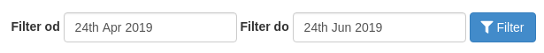
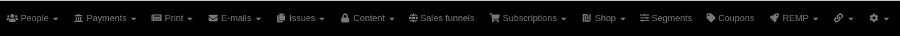

# CRM Admin Module

## Secured login

CRM provides another layer of security when accessing admin. If you enable `admin_secure_login_check` flag in your application configuration ("Require secure authentication method for admin roles" in CRM admin), CRM will require a set of specific flags to be present in order to grant access to the administration:

- Session flag set during the login stating that it was a secure login.
  - This needs to be decided and set by you and implemented through your own SignInEventHandler. Reference implementation is below. We usually recommend setting this flag when there's a Google sign in session from a specific verified domain.
- User meta flag `secure_login_allowed` set manually in the CRM admin (through user detail). Consider this as a one-time confirmation that user can actually access the admin.

### Reference implementation of the sign in event handler

```php
class UserSignInEventHandler extends AbstractListener
{
    private const SECURE_LOGIN_META = 'secure_logged_in';

    private $secureAdminAccess;

    public function __construct(SecuredAdminAccess $securedAdminAccess) {
        $this->secureAdminAccess = $securedAdminAccess;
    }

    public function handle(EventInterface $event)
    {
        if (!$event instanceof UserSignInEvent) {
            throw new \Exception("Invalid type of event received, UserSignInEvent expected, got: " . get_class($event));
        }

        $source = $event->getSource();

        if ($source === \Crm\UsersModule\Auth\Sso\GoogleSignIn::ACCESS_TOKEN_SOURCE_WEB_GOOGLE_SSO) {
            $this->secureAdminAccess->setSecure(true);
            return;
        }

        $this->secureAdminAccess->setSecure(false);
    }
}
```

[](https://hosted.weblate.org/projects/remp-crm/admin-module/)

## Components

**DateFilterFormFactory**

General from/to date filter with optional container.



[Source code](https://github.com/remp2020/crm-admin-module/blob/master/src/Components/DateFilterFormFactory.php)

[How to use](https://github.com/remp2020/crm-subscriptions-module/blob/master/src/Presenters/DashboardPresenter.php#L57)

**AdminMenu**

Top admin menu.



[Source code](https://github.com/remp2020/crm-admin-module/blob/master/src/Components/AdminMenu/AdminMenu.php)

[How to use](https://github.com/remp2020/crm-admin-module/blob/master/src/Presenters/AdminPresenter.php#L50)
